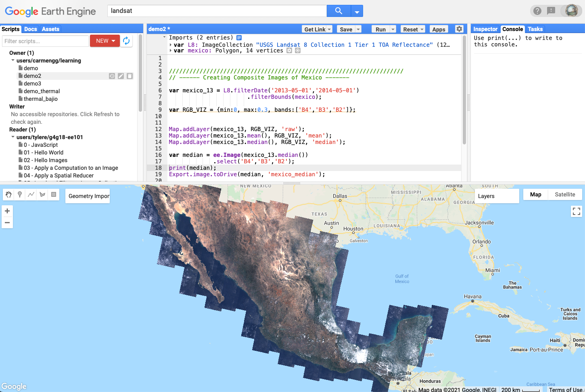

```{r setup, include=FALSE}
knitr::opts_chunk$set(echo = TRUE, warning=FALSE, message=FALSE, cache=TRUE, fig.align="center")

library(raster) ### NOTE: attach this BEFORE tidyverse
library(tidyverse)
library(here)
library(sf)
library(fasterize)
library(patchwork)
library(knitr)
```


# About the Data

I generated the raster file *mexico_median.tif* using [Google Earth Engine](https://earthengine.google.com). 
It is available in my [GitHub repository](https://github.com/carmengg/mexico_rasters.git) for this project. 
This raster shows the median of the images in the [USGS Landsat 8 Collection 1 (Tier 1 TOA Reflectance)](https://developers.google.com/earth-engine/datasets/catalog/LANDSAT_LC08_C01_T1_TOA) from May 1st 2013 to May 1st 2014. 
I will probably write another blog post about how I used Google Earth Engine! Meanwhile, here's a screenshot of the Java script.

<!--
```{r eval=TRUE, echo=FALSE, out.width = "60%", out.height="49%", fig.show='hold',fig.align="center"}

mexico_engine <- here('_posts','2021-05-28-mexico-rasters','mexico_engine.png')
#knitr::include_graphics(c(serenoa, sabal))
```

```{r eval=TRUE, echo=FALSE, out.width = "60%", out.height="49%", fig.align="center"}

knitr::include_graphics(mexico_engine)
```
-->


<br>
<br>

# Raster exploration

The Landsat 8 raster I produced using Google Earth Engine is a coarse approximation of Mexico's shape. 
It is calculated using all the Landsat 8 scenes that intersect a coarse polygon enclosing Mexico. 
We can see here the red, green and blue layers (RGB).


```{r, out.width = "35%", out.height = "35%"}
# -----  EXPLORING RGB LAYERS -----
# read all bands as raster stack
mex_rgb <- raster::stack(here('_posts/2021-05-28-mexico-rasters/mexico_median_rgb.tif')) 
#mex_rgb
# looking at stack information we get that:
#   B4 band = red
#   B3 band = green
#   B2 band = blue

# ---- Define Plot Function ----
color_graph <- function(band,color){
  return (plot(band, 
               col = hcl.colors(n = 100, palette = color),
               axes = FALSE,
               legend = FALSE)
          )
}
# --- Colors
RGB = c('Reds 2', 'Greens 2', 'Blues 2')

# --- plot RGB bands
for (i in 1:3){
  color_graph(mex_rgb[[i]],RGB[i])
}
```

<br>
<br>

# Masking

To do the masking and select only the region corresponding to Mexico I used a [polygon shapefile](https://geodata.lib.berkeley.edu/catalog/stanford-zc863pb5331) made by Hijmans, Robert J. from the Museum of Vertebrate Zoology at UC Berkeley. 
To use the polygon shapefile for masking we need to convert it into a raster. 
Then we can use it mask each layer of the raster stack.

```{r}
# --- read shapefile
mex_sf <- read_sf(here('_posts/2021-05-28-mexico-rasters/stanford-zc863pb5331-shapefile/zc863pb5331.shp')) %>%
  st_transform(crs(mex_rgb))   # match CRS

# --- transform shapefile into raster using red band as guide
mex_rast <- fasterize::fasterize(mex_sf, mex_rgb[[1]])
#writeRaster(mex_rast, 'data/county.tif') #export mask raster
plot(mex_rast,axes=FALSE, box=FALSE)

```

```{r, out.width = "35%", out.height = "35%"}
# --- mask each layer
for (i in 1:3){
  mex_rgb[[i]] <- mask(mex_rgb[[i]],mex_rast)
}
rm(mex_rast)

# --- plot masked RGB bands
for (i in 1:3){
  color_graph(mex_rgb[[i]],RGB[i])
}

```
<br>
<br>

# True Color

Now that we have the masked red, green and blue bands, we can use these to make a true color composite image of Mexico.
It is a close replica to what we can see with our eyes. Notice too the storm around Tabasco. This is slightly inconvenient because it doesn't allow to have a clear view of the ground.

```{r}
plotRGB(mex_rgb, scale=0.63, colNA='skyblue1')
```

<br>
<br>

# Normalized Differential Vegetation Index (NDVI)

## Near-Infrared Band
To calculate the NDVI we need the near-infrared band too. 
Since the previous raster only contained RGB bands, here I added a raster I generated with Google Earth Engine that shows the median of the near-infrared band from May 1, 2013 to May 1, 2014.

```{r}
# --- read nir raster
nir <- raster(here('_posts/2021-05-28-mexico-rasters/mexico_median_nir.tif')) 

# --- masking (note: had to update mask to match extent of nir raster)
mex_rast2 <- fasterize::fasterize(mex_sf, nir)
nir <- mask(nir, mex_rast2)
rm(mex_rast2)

# --- plot
color_graph(nir,'OrRd')

```

## NDVI calculation
According to the [Earth Observing System](
https://eos.com/blog/ndvi-faq-all-you-need-to-know-about-ndvi/)


> The results of the NDVI calculation range from -1 to 1. Negative values correspond to areas with water surfaces, manmade structures, rocks, clouds, snow; bare soil usually falls within 0.1- 0.2 range; and plants will always have positive values between 0.2 and 1. Healthy, dense vegetation canopy should be above 0.5, and sparse vegetation will most likely fall within 0.2 to 0.5. 

The NDVI is calculated using the near-infrared and red bands of the satellite image. The formula is
$$NDVI = \frac{NIR - Red}{NIR + Red}.$$
The following is a map that outlines zones in Mexico with dense vegetation ($0.5\leq NDVI$), made with code based on [this repository](https://github.com/oharac/esm244_w2021_lab6_rasters) by C. O'Hara.

```{r, preview=TRUE}
# ---- NDVI calculation ----
ndvi <- (nir - mex_rgb[[1]]) / (nir + mex_rgb[[1]]) 


# --- Dense Vegetation Function ---
Fdense_veg <- function(x) {
  return(ifelse(0.5<=x, 1, NA))
}
# --- dense vegetation data frame
df_dense <- calc(ndvi, fun = Fdense_veg) %>% 
   raster::rasterToPoints() %>%
   as.data.frame()
# --- ndvi data frame
df_ndvi <- ndvi %>% 
  raster::rasterToPoints() %>%
  as.data.frame()


ggplot() +
  geom_tile(data = df_ndvi, aes(x = x, y = y, fill = layer)) +
  geom_tile(data = df_dense, aes(x = x, y = y),fill = 'green4') +
  coord_sf(expand = 0) +
  scale_fill_gradient(low = 'black', high = 'white') +
  labs(fill='NDVI')+
  theme_void()
```

**Fig 1.** Zones in Mexico with median dense vegetation ($0.5\leq NDVI$) in color green, from 05/01/2013 to 05/01/2014 mapped over an NDVI map of the country.


# References
**Boundary, Mexico, 2015.** Hijmans, Robert J. and University of California, Berkeley. Museum of Vertebrate Zoology.  
https://geodata.lib.berkeley.edu/catalog/stanford-zc863pb5331

**USGS Landsat 8 Collection 1 Tier 1 TOA Reflectance.** Dataset Provider: USGS/Google. 
https://developers.google.com/earth-engine/datasets/catalog/LANDSAT_LC08_C01_T1_TOA

**GitHub repository: esm244_w2021_lab6_rasters** C. O'Hara, 2021.
https://github.com/oharac/esm244_w2021_lab6_rasters