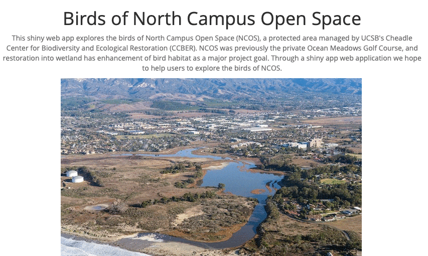

```{r setup, include=FALSE}
knitr::opts_chunk$set(echo = FALSE)
library(here)

```

```{r,preview=TRUE, out.width = "45%", out.height="35%", fig.align="center"}

kites <- here('_posts','2021-06-04-ncos-shiny-app','IMG_1677.jpg')
knitr::include_graphics(kites)
```

<br>


Birding is one of my favorite hobbies, and UCSB's North Campus Open Space is one of my favorite places for this activity! So I was happy to collaborate with ecological restoration expert A. Kreisberg to make this R Shiny web app that explores bird sightings at this unique environmental preserve. 

# Click on the gif below to access the app!

<br>
<br>


[](https://carmengg.shinyapps.io/244-shiny-app/)
